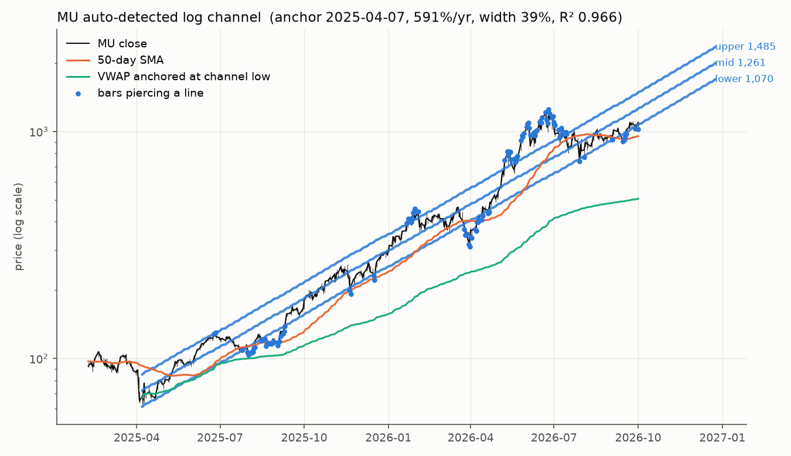
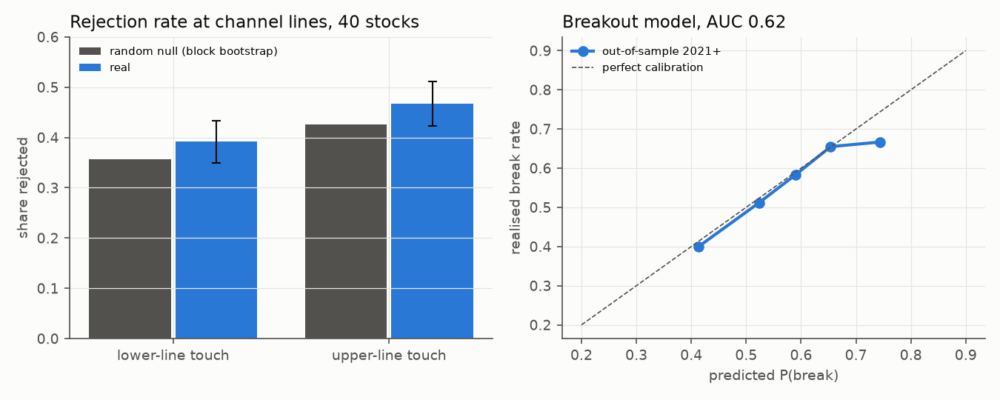
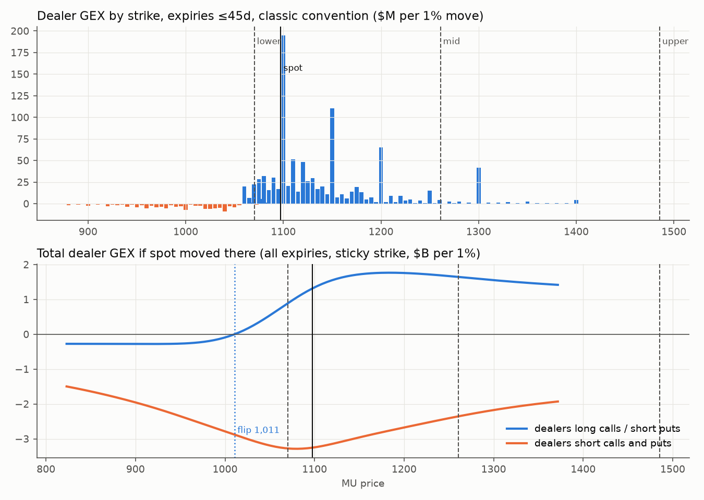
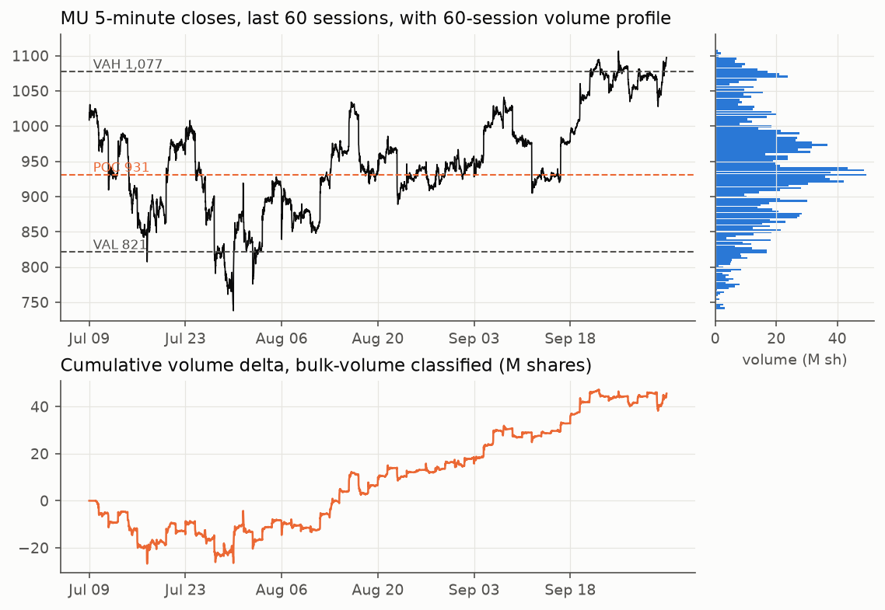

# Log-scale channels, from macrostructure to microstructure: MU case study

Data snapshot: close of **2026-10-01** (MU 1,097.39). Daily bars for 40 large caps
(10y), MU 5-minute (60 sessions) and 1-minute (7 sessions) bars, and the full MU
option chain (22 expiries, 3.49M contracts of open interest). All from Yahoo.
Everything below is reproducible with the scripts in this folder (see bottom).

---

## TL;DR

1. **Yes, the lines can be drawn by a computer.** Rotate a ruler in log space
   until the band holding 70% of wicks is as narrow as possible, and pick the
   anchor by scanning swing lows. Run blind on MU, the algorithm picks the
   **2025-04-07 low** (the same one you drew from) and returns a **591%/yr**
   channel, 39% wide, with R² 0.966. Today's lines: **lower 1,070 · mid 1,261 · upper 1,485**.
2. **Why log scale:** returns compound, so a constant growth rate is a straight line
   in log space. The *parallel* lines come from a moving-average identity: in a
   log-linear trend, an N-day SMA trails price by a **constant** log distance
   b·(N−1)/2. For MU that predicts the 50-day SMA sits 18.8% below the midline;
   the observed average is 16.2%, almost exactly the lower rail (16.4%). **The lower
   line is the 50-day SMA that dip buyers watch, drawn as a straight line.**
3. **Brute-force test: lines are mostly not magic.** Across 40 stocks and about 2,000
   fresh line touches (no look-ahead), rejection rates at lines are 4 pts higher than
   in random paths built from each stock's own returns. But the random-path rate sits
   **inside** the 95% confidence interval on both sides. Most of the "respect" you see
   is what any trending, volatile random walk looks like once you fit lines to it.
4. **Breakouts are partly predictable.** A walk-forward logistic model (trained before
   2021, tested 2021 onward) gets an out-of-sample **AUC of 0.62** and is well
   calibrated. Two things drive it. First, which line is touched: counter-trend lines
   break 62% of the time, with-trend lines 46%. Second, how fast price approaches the
   line, plus volatility expanding (not compressing). High volume at the touch
   slightly favors rejection (absorption).
5. **Microstructure right now (MU):** your channel has a deadline. The lower line rises
   0.77%/day, so **if MU goes flat it breaks the channel in about 3 trading days**,
   without any selloff. Options map:
   - Biggest dealer-gamma strike is **1,100**, right at spot; the next are 1,150, 1,200 and 1,300 (call open-interest wall).
   - Gamma flip is about **1,011** (classic sign convention), just under the lower line.
   - Put support is at 1,000.
   - Price just pushed above the 60-session value-area high (1,077).
   - Breakout up needs acceptance above 1,100 → 1,150. Breakdown means losing 1,070 and then 1,011, where hedging flips from dampening moves to amplifying them.

---

## 1. Computing the lines (`channels.py`)

Model: `log P(t) = a + b·t + e(t)`, with t as the trading-bar index (what a
TradingView log chart uses on its x-axis).

* **Slope:** choose b to minimise `q85(log high − b·t) − q15(log low − b·t)`. That
  is the narrowest strip containing 70% of the highs and lows. Using quantiles instead
  of max/min is what lets the June-2026 blow-off poke through, as it does in your
  drawing.
* **Lines:** upper and lower are those two quantiles; the mid is halfway.
* **Anchor:** test every 10-bar swing low 120–750 bars back. Score =
  `R² · log(length) · total trend move / width`, and keep the best.
* The tolerance `q` sets the style: 3% gives a 93% wide envelope, **15% gives 39%
  (closest to your picture)**, 25% gives 26%.



Channel residual dynamics: AR(1) φ = 0.960 → **mean-reversion half-life about 17
trading days**. In theory the band acts like a spring (an Ornstein–Uhlenbeck
process around the trend). Section 3 tests whether that is real or just a
side effect of fitting the line.

## 2. Why price looks like it respects log channels: the thesis

| Mechanism | Prediction | Evidence here |
|---|---|---|
| Returns compound, so constant growth is linear in log | Straight trend line in log space only | R² 0.966 over 374 bars |
| **SMA-lag identity**: SMA_N trails a log-linear trend by b(N−1)/2 | 20/50/100-day SMAs are *parallel lines* at fixed offsets | Predicted −7.3% / −18.8% / −38.0% vs mid; observed −6.2% / −16.2% / −33.7%. Lower rail at −16.4% ≈ 50-day SMA |
| Dip buyers, CTAs and vol-targeters size in *percent* of NAV / ATR | Pullbacks are a constant % deep, so the channel width stays constant in log space | Width is stable while price went ×17 |
| Option strikes cluster at *% out of the money*, and as price rises the open interest gets rolled to higher strikes | The gamma "ceiling" travels with price at a roughly constant % above it | Call-OI strikes now sit 0–18% above spot (1,100/1,150/1,200/1,300) |
| Anchored VWAP from the low | A support level | **Rejected for this trend**: the AVWAP rises far more slowly and sits about 50% under price. It is not the rail |

**What breaks the channel:** the slope has to keep being paid for. Any month
where price grows slower than the slope (here 0.77%/day, about 17%/month)
mechanically walks price down through the lower line. That's why channels this
steep end in *time* (sideways), not necessarily in crashes. The 50-day SMA
(954 today) now sits **below** the lower line (1,070), because price has gone
sideways since June. The flow anchor has already separated from the geometric line.

## 3. Brute force: do lines matter beyond chance? (`backtest.py`)

Setup:

* **Universe and channels:** 40 stocks/ETFs, 10 years. Rolling channels (126 and 252 bars), refit every 5 bars on past data only, kept when R² ≥ 0.75.
* **Event:** a fresh touch, meaning a wick reaches a line after 5 bars without touching it.
* **Outcome (within 20 bars):** *break* = close 0.5 half-widths beyond the line; *reject* = close 0.5 half-widths back inside. The two thresholds are symmetric, so a coin-flip world gives about 50/50.
* **Null:** 12 stationary block-bootstrap paths per stock (mean block 10 days). This keeps drift, fat tails and volatility clustering but destroys any memory of price levels. The identical pipeline runs on the fake paths.

| | real reject | 95% CI (month-clustered) | null reject |
|---|---|---|---|
| lower-line touch (n = 1,194) | 39.2% | 34.9–43.4% | 35.6% |
| upper-line touch (n = 811) | 46.7% | 42.3–51.1% | 42.6% |

The real rate is higher on both sides, but neither difference is statistically
significant. In short: the channel helps you describe the trend, but it is not
yet an edge on its own.

Options-calendar tests (2018 onward, cross-sectional means per date, 105 monthly expiries):

* **Pinning:** distance of the opex-Friday close to the nearest strike = 0.247 strike units vs 0.249 on other Fridays (±0.002). **No measurable pin at the daily close.**
* **Vanna/charm drift:** week into opex −8 bp vs week after +51 bp (difference −60 ± 52 bp); realized volatility after opex / before = 1.06 vs 1.05 on other weeks. **Not significant.** The folklore exists, but you can't detect it on daily closes; it has to be measured intraday.

## 4. Predicting breakouts

Features at the touch:

* trend quality: R², slope (signed to the touched side)
* channel width in volatility units
* volatility ratio (10-day vs 60-day realized vol)
* 5-day vs 50-day volume
* 5-day close-location-value delta (a crude daily buy-vs-sell proxy)
* number of prior touches
* approach speed
* range vs ATR, gap size, extension above the 20-day SMA

One feature was removed: how far the touch bar closed through the line. Including it
pushes AUC to 0.71, but it is partly mechanical (that bar is already part way to the
break threshold).



* Out-of-sample (2021 onward, n = 1,289): AUC **0.62**, calibrated. Predicted 41% → realised 40%; predicted 74% → realised 67%.
* **Which line, relative to trend:** the biggest single driver. Counter-trend lines (the lower line of an uptrend) break 62% of the time, with-trend lines 46%. Strong trends fail by *losing support*, not by pausing at the ceiling.
* **Approach speed:** fast approaches break more often, 62% in the top third vs 51% in the bottom third.
* **Volatility expanding:** helps (coefficient +0.39). The "squeeze" story, a compressed range before a breakout, does not show up at this horizon.
* **Volume at the touch:** high volume slightly favours rejection (−0.27). That is the absorption signature: big volume at the line without progress.

## 4b. Level hopping: do the lines predict which level is hit next? (`level_hits.py`)

Starting point: 351 moments in uptrend channels (39 stocks) where price sat at the lower line, like MU now. The benchmark is a driftless random walk with trailing 20-day realized vol; its barrier distances include the drift of the rising lines.

| Target within 20 bars | Hit | Random walk | Excess (95% CI, month-clustered) |
|---|---|---|---|
| Mid line | 23% | 24% | −1 pt (−7, +6) |
| Upper line | 6% | 7% | −1 pt (−4, +3) |
| Half a band below | 77% | 84% | −7 pt (−13, −1) |
| Next level down | 52% | 50% | +2 pt (−5, +9) |

**The levels carry almost no information beyond volatility.** Jumps between levels are just volatility measured in band-widths. For options, this moves the edge from *which level* to *realized vs implied volatility* and pin-vs-trend behaviour, where dealer gamma positioning is the candidate predictor (see §7).

## 5. MU microstructure snapshot (`options_flow.py`, `flow_intraday.py`)



There is no free data on who is long or short each option, so dealer positioning is shown under two sign conventions.

**Classic convention (dealers long calls, short puts):**

| Item | Value |
|---|---|
| Net GEX | **+$1.31B per 1% move**, about 4.9% of MU's $26.8B average daily dollar volume, enough to dampen intraday moves |
| Gamma flip | **≈ 1,011** |
| Vanna | +$385M of dealer delta per +1 IV point |
| Charm | +$1.1B/day. Under this convention, time decay mechanically adds dealer buying into expiries while above the flip |

**If customers are net buyers of everything (likely in a parabolic name):**
net GEX is **−$3.25B per 1%**, so negative gamma everywhere. The 1,100 strike then
becomes the biggest *accelerator* rather than a pin. The truth sits between the two
conventions. Signed trade data (see §7) is what settles it.

| Level | Source |
|---|---|
| 1,485 | upper channel line |
| 1,300 | largest call OI (≤ 45 days), the call wall |
| 1,261 | mid channel line |
| 1,200 / 1,150 | next big gamma strikes |
| **1,100** | largest gamma strike, right at spot; today's 0DTE expiry |
| 1,077 | 60-session value-area high (price just accepted above it) |
| **1,070** | lower channel line (rises about 8 points/day) |
| 1,045–1,055 | max pain, 2/5/7 Oct expiries |
| **1,011** | gamma flip (classic) |
| 1,000 | large put + call open interest |
| 954 | 50-day SMA |
| 931 | 60-session point of control (POC) |

* Implied 1-standard-deviation move (straddle): ±3.4% today, ±7.9% by 9 Oct, ±15.4% by 30 Oct. ATM IV is about 53–55%, after the 30 Sep earnings.
* Put/call open-interest ratio for expiries ≤ 45 days: 1.12.



* **Order flow** (bulk-volume classification on 5-minute bars, a proxy, not real tape):
  - Cumulative volume delta is **+45.6M shares** over 60 sessions, climbing steadily from Aug 6. That is accumulation while price chopped in a 750–1,100 range.
  - The daily delta-vs-return correlation is 0.91. That is largely by construction (the classifier assigns direction from the price change), so read the level and its divergences, not the correlation.
* **Block detection:** only 3 five-minute bars cleared a 4-sigma volume threshold. Real block, sweep and iceberg detection needs tick-level prints.

### Breakout / breakdown playbook (rules derived from the above, not a forecast)

* **Up:** hold above 1,100 into the close.
  - Watch for rising IV *and* rising price. That combination means dealers are short calls, which is the negative-gamma squeeze case.
  - CVD should make new highs alongside price.
  - Targets: 1,150 → 1,200 → mid line 1,261 → call wall 1,300.
  - **Speed is required:** a channel this steep needs about +0.8%/day just to stay inside.
* **Down:** close below the lower line (1,070, rising), then below 1,011 (gamma flip).
  - Below the flip, dealer hedging amplifies moves.
  - That is the "counter-trend line" break, which the backtest says happens 62% of the time once tested, and a fast approach raises the odds.
  - Next magnets: 1,000 (put open interest), 954 (50-day SMA), 931 (POC).
* **Most likely by base rates:** time decay. Price chops between 1,045 and 1,150, pinned around 1,100 by near-dated gamma. The rising lower line runs into it within 3–9 sessions, so the *channel* ends even if the *stock* doesn't fall.

## 6. Limitations (read before trading this)

* Yahoo has no signed options trades, no historical open interest and no Level-2 data, so the GEX/vanna/charm levels are a **single-day snapshot** and the dealer sign is assumed.
* IVs were re-solved from last-trade prices and smoothed per expiry.
* Bulk-volume classification and close-location-value delta are classification proxies, not aggressor-side prints.
* The universe has survivorship bias (all are current winners), so trend persistence is probably overstated.
* Events from the 126- and 252-bar windows overlap. The confidence intervals are clustered by calendar month to absorb some of this.

## 7. Next data to get a real microstructure answer

1. **Signed options trades** (OPRA trade-level: Cboe LiveVol, ORATS, Unusual Whales/Tradier) to fix the dealer sign, plus daily open-interest history so §5 can be backtested the way §3 was.
2. **Trade and quote data** (Polygon/Databento) for real aggressor delta, block/sweep detection, and absorption at the lines. Then rerun §4 with tape features.
3. Rerun `calendar_tests` on intraday data (last-hour moves into opex) to measure pinning and vanna/charm at the resolution where they actually operate.

## Reproduce

```bash
pip install -r requirements.txt
python fetch.py MU            # MU daily/5m/1m + full option chain
python fetch.py --universe    # daily bars for the 40-name universe
python channels.py            # current MU channel
python backtest.py            # ~3-4 min on 4 cores -> out/backtest.json, out/events.csv
python report.py              # figures + out/report_numbers.json
```
